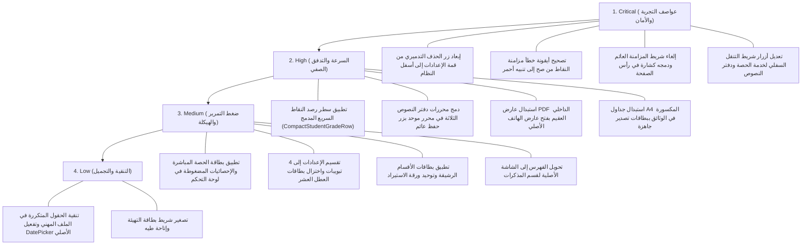

# المرجع الهندسي الشامل لتدقيق الواجهات وتجربة الاستخدام (UI/UX Master Audit & Blueprints)

**تطبيق «مُعِين الأستاذ» — الطور الثانوي للعلوم الإسلامية (الجزائر)**

---

## فهرس التقرير الشامل

1. [الرؤية الاستراتيجية والمعمارية العامة (Macro Architecture & Positioning)](#1-الرؤية-الاستراتيجية-والمعمارية-العامة)
2. [المشاكل الهيكلية الكبرى عبر التطبيق (Macro UX Patterns)](#2-المشاكل-الهيكلية-الكبرى-عبر-التطبيق)
3. [التدقيق الجراحي للشاشات والمخططات الهندسية البديلة (Screen-by-Screen Audits & Blueprints)](#3-التدقيق-الجراحي-للشاشات-والمخططات-الهندسية-البديلة)
   - [المجموعة 1: شاشة البداية، الهبوط، تسجيل الدخول، القائمة الجانبية، وبطاقة التهيئة](#مجموعة-1-البداية-الدخول-القائمة-الجانبية-والتهيئة)
   - [المجموعة 2: لوحة التحكم الميدانية، إضافة الحصص، التوزيع السنوي، والمنهاج](#مجموعة-2-لوحة-التحكم-إضافة-الحصص-التوزيع-والمنهاج)
   - [المجموعة 3: المذكرات والبطاقات البيداغوجية وعارض الـ PDF](#مجموعة-3-المذكرات-البطاقات-البيداغوجية-وعارض-pdf)
   - [المجموعة 4: دفتر النصوص، بطاقات الأقسام المسندة، وقوائم واستيراد التلاميذ](#مجموعة-4-دفتر-النصوص-الأقسام-المسندة-واستيراد-التلاميذ)
   - [المجموعة 5: دفتر النقاط، إحصائيات مجالس الأقسام، واستخراج الوثائق](#مجموعة-5-دفتر-النقاط-مجالس-الأقسام-واستخراج-الوثائق)
   - [المجموعة 6: الإعدادات، الملف المهني، الفصول والعطل، ومنطقة العمليات الحساسة](#مجموعة-6-الإعدادات-الملف-المهني-العطل-ومنطقة-الخطر)
4. [مصفوفة المكونات والملفات المستهدفة بالتعديل (Target File Refactoring Matrix)](#4-مصفوفة-المكونات-والملفات-المستهدفة-بالتعديل)
5. [خطة العمل التنفيذية الموحدة حسب الأولوية (Prioritized Action Plan)](#5-خطة-العمل-التنفيذية-الموحدة-حسب-الأولوية)
6. [الحكم النهائي على الجاهزية الميدانية](#6-الحكم-النهائي-على-الجاهزية-الميدانية)

---

## 1. الرؤية الاستراتيجية والمعمارية العامة

### 1.1. طبيعة وسياق استخدام التطبيق

- **أداة عمل شخصية للأستاذ (Personal Workflow Cockpit):** التطبيق ليس منظومة مدرسية متعددة الأدوار (ليس School ERP)، بل أداة سريعة في راحة يد أستاذ مادة العلوم الإسلامية بالتعليم الثانوي في الجزائر.
- **بيئة العمل الميدانية الحقيقية:**
  - حركة دائمة داخل الحجرة الدراسية، هاتف يُحمل بيد واحدة، شاشة متوسطة الحجم (6 بوصات تقريباً).
  - تغطية شبكة هاتف (3G/4G) ضعيفة أو منعدمة في كثير من المؤسسات التعليمية ذات الجدران السميكة، وانعدام شبكات Wi-Fi المفتوحة للأساتذة.
  - زمن صفي محدود (الحصة 60 دقيقة)؛ كل عملية يجب أن تُنجز في ثوانٍ معدودة دون تشتيت انتباه الأستاذ عن شروحاته وإدارة القسم.

### 1.2. دمج مراجعة المنطق البيداغوجي مع التدقيق البصري

التطبيق يتميز بدقة متناهية في احترام التشريعات التربوية الجزائرية:

- صيغة المعدل الوزاري الرسمي: $\frac{(\text{التقويم المستمر} + \text{الفرض}) + (\text{الاختبار} \times 2)}{4}$.
- تقسيم مجالات مجالس الأقسام الرسمية (`<8`، `[8-10[`، `[10-12[`، ...).
- تفريق الحجم الساعي (ساعة أسبوعياً لجذع مشترك علوم، ساعتان لباقي الأقسام).
- استيراد ملفات الرقمنة الحكومية وبرنامج الممتاز.
  **المطلوب الآن:** نقل هذه القوة البيداغوجية من تصميم حاسوبي مكتبي ثقيل إلى واجهات هاتف فائقة الرشاقة والسرعة.

---

## 2. المشاكل الهيكلية الكبرى عبر التطبيق (Macro UX Patterns)

### المشكلة الأولى: ازدواجية وتصادم أنظمة التنقل (Navigation Collision)

- **المظهر الحالي:** وجود شريط سفلي دائم بـ 5 عناصر، وقائمة جانبية بـ 12 عنصراً مكرراً. بل ويحدث اصطدام مرئي ملحوظ حيث ينفذ زر "الجدول" من الشريط السفلي تحت القائمة الجانبية المفتوحة.
- **الحل المعماري:**
  1. حصر **الشريط السفلي** في المهام اليومية المتكررة: `[ الرئيسية | الحصة الحالية (Live) | دفتر النصوص | النقاط | المزيد ]`.
  2. تحويل **القائمة الجانبية** إلى درج خدمات وإعدادات (Utility Drawer) يحتوي فقط على: الملف المهني، الوثائق الرسمية، إدارة المزامنة، والإعدادات. إزالة أي عنصر موجود في الشريط السفلي من القائمة الجانبية كلياً.

### المشكلة الثانية: عائق شريط المزامنة العائم (The Floating Alert Blocker)

- **المظهر الحالي:** شريط إشعار عائم في أسفل الشاشة يحجب مساحة تتجاوز `60px` من الـ Viewport، ويتداخل مع شريط التنقل وأزرار الحفظ في أسفل الصفحات.
- **الحل المعماري:** إلغاء الشريط العائم كلياً، ونقل حالة المزامنة إلى **شارة مدمجة صغيرة في شريط العنوان العلوي (Header Badge)** تظهر بنبضات هادئة: (حفظ محلي / جارٍ المزامنة / متزامن).

### المشكلة الثالثة: إرهاق التمرير والبطاقات المتداخلة (Nested Cards & Infinite Scrolling)

- **المظهر الحالي:** حاويات داخل حاويات، وبطاقات تلتهم `300px` رأسية لكل تلميذ أو قسم، مما يرفع مسافة التمرير إلى آلاف البكسلات للوصول إلى معلومة بسيطة.
- **الحل المعماري:** تطبيق مبدأ **الإفصاح التدريجي (Progressive Disclosure)**؛ إظهار السطر الأساسي المهم للمهمة الحالية (ارتفاع بين 48px و64px)، وترك التفاصيل تتمدد بنقرة اختيارية.

### المشكلة الرابعة: الاصطدام بلوحة مفاتيح الجوال (Virtual Keyboard Occlusion)

- **المظهر الحالي:** في النوافذ المنبثقة وجداول النقاط والمحررات، يؤدي فتح لوحة المفاتيح إلى حجب حقول الإدخال وأزرار الحفظ، مما يعطل التدفق.
- **الحل المعماري:** استبدال الـ Modals العائمة بـ **أوراق عمل سفلية (Bottom Sheets)** تتحرك بمرونة مع ارتفاع لوحة المفاتيح.

---

## 3. التدقيق الجراحي للشاشات والمخططات الهندسية البديلة

---

### مجموعة 1: البداية، الدخول، القائمة الجانبية، والتهيئة

_الملفات المرجعية:_ `1000030553.jpg` إلى `1000030562.jpg`

#### 1.1. شاشة البداية والتحميل (Splash & Loading)

- **المشكلة:** دوران لا نهائي لحلقة التحميل دون إمكانية التخطي عند غياب الشبكة.
- **الحل الهندسي:** إضافة زر طوارئ يظهر تلقائياً بعد ثانيتين: `المتابعة دون اتصال (الوضع المحلي)`.

#### 1.2. شاشة الهبوط وتسجيل الدخول (Landing & Auth)

- **المشكلة:** انقسام الشاشة لكتلتين غير متوازنتين، وزر Google يفتقر للهوية البصرية الرسمية، والنموذج عائم في المنتصف ينضغط عند ظهور لوحة المفاتيح.
- **الحل الهندسي:**
  - تثبيت زر الدخول في شريط سفلي في متناول الإبهام.
  - تصميم نموذج الدخول كـ Bottom Sheet مريح، مع أيقونة Google الملونة لتعزيز الموثوقية.

#### 1.3. بطاقة التهيئة الترحيبية (Onboarding Card)

- **المشكلة:** بطاقة خضراء داكنة عملاقة تحجب 80% من الشاشة الأولى وتخفي المحتوى الحقيقي تحتها.
- **الكود البديل المعتمد:**

```tsx
// components/dashboard/CompactOnboarding.tsx
import React, { useState } from "react";
import { CheckCircle2, ChevronDown, ChevronUp, ArrowLeft } from "lucide-react";

export function CompactOnboarding({ currentStep = 2, totalSteps = 4 }) {
  const [isExpanded, setIsExpanded] = useState(false);

  return (
    <div className="mx-4 my-3 rounded-2xl bg-gradient-to-l from-teal-900 to-slate-900 text-white p-4 shadow-sm">
      <div className="flex items-center justify-between">
        <div>
          <span className="text-xs font-medium text-teal-300">
            الخطوة {currentStep} من {totalSteps}
          </span>
          <h3 className="text-sm font-bold mt-0.5">
            إعداد الملف المهني والمؤسسة
          </h3>
        </div>
        <button
          onClick={() => setIsExpanded(!isExpanded)}
          className="p-1.5 rounded-lg bg-white/10 hover:bg-white/20 transition-colors">
          {isExpanded ? <ChevronUp size={18} /> : <ChevronDown size={18} />}
        </button>
      </div>

      <div className="w-full bg-white/10 h-1.5 rounded-full mt-3 overflow-hidden">
        <div
          className="bg-teal-400 h-full rounded-full transition-all duration-300"
          style={{ width: `${(currentStep / totalSteps) * 100}%` }}
        />
      </div>

      {isExpanded && (
        <div className="mt-4 pt-3 border-t border-white/10 space-y-2">
          <button className="w-full flex items-center justify-between p-2.5 rounded-xl bg-white/5 text-xs text-right">
            <span className="flex items-center gap-2">
              <CheckCircle2 size={16} className="text-teal-400" />
              <span>حذف البيانات التجريبية</span>
            </span>
            <span className="text-slate-400 text-[10px]">مكتمل</span>
          </button>
          <button className="w-full flex items-center justify-between p-2.5 rounded-xl bg-teal-600/30 border border-teal-500/30 text-xs text-right font-medium">
            <span>2. إكمال الملف المهني</span>
            <ArrowLeft size={14} className="text-teal-300" />
          </button>
        </div>
      )}
    </div>
  );
}
```

---

### مجموعة 2: لوحة التحكم، إضافة الحصص، التوزيع، والمنهاج

_الملفات المرجعية:_ `1000030616.jpg` إلى `1000030625.jpg`

#### 2.1. لوحة التحكم الميدانية (The Hero Action Cockpit)

- **المشكلة:** شبكة إحصائيات 2×2 تلتهم نصف الشاشة، مع تكرار زر "إدخال حصص اليوم" في ثلاثة مواضع مختلفة.
- **الكود البديل المعتمد:** شريط إحصائي مدمج (`50px`) يعلو بطاقة الحصة الجارية التفاعلية بنقرة حضور ونقرة دفتر نصوص:

```tsx
// components/dashboard/MobileCockpitHeader.tsx
import React from "react";
import { Clock, Play, BookOpen } from "lucide-react";

export function MobileCockpitHeader({
  teacherName = "أ. هشام عبد الرحيم",
  currentSession = {
    className: "2 ع ت 1",
    room: "قاعة 01",
    time: "14:30 - 15:30",
    topic: "من خصائص الشريعة الإسلامية",
  },
  stats = { classes: 9, students: 308, recordedSessions: 0 },
}) {
  return (
    <div className="p-4 space-y-3 bg-slate-50 border-b border-slate-200">
      <div className="flex items-center justify-between">
        <div>
          <span className="text-[11px] text-slate-500 font-medium">
            مرحباً بك
          </span>
          <h2 className="text-base font-bold text-slate-900 leading-tight">
            {teacherName}
          </h2>
        </div>
        <div className="flex items-center gap-1.5 px-2.5 py-1 rounded-full bg-amber-50 text-amber-800 border border-amber-200/80 text-[11px] font-medium">
          <span className="w-1.5 h-1.5 rounded-full bg-amber-500 animate-pulse" />
          <span>حفظ محلي</span>
        </div>
      </div>

      <div className="rounded-2xl bg-gradient-to-l from-teal-800 to-slate-900 text-white p-4 shadow-sm">
        <div className="flex items-center justify-between text-xs text-teal-300 mb-2">
          <span className="flex items-center gap-1 font-medium">
            <Clock size={14} />
            {currentSession.time}
          </span>
          <span className="bg-white/10 px-2 py-0.5 rounded-md text-[11px]">
            {currentSession.room}
          </span>
        </div>
        <div className="mb-3">
          <span className="text-lg font-black text-white">
            {currentSession.className}
          </span>
          <p className="text-xs text-slate-300 line-clamp-1 mt-0.5">
            {currentSession.topic}
          </p>
        </div>
        <div className="grid grid-cols-2 gap-2 pt-1 border-t border-white/10">
          <button className="flex items-center justify-center gap-1.5 py-2.5 bg-teal-500 hover:bg-teal-400 active:scale-[0.98] text-slate-950 rounded-xl font-bold text-xs transition-all">
            <Play size={14} className="fill-current" />
            <span>تسجيل الحضور</span>
          </button>
          <button className="flex items-center justify-center gap-1.5 py-2.5 bg-white/10 hover:bg-white/20 active:scale-[0.98] text-white rounded-xl font-medium text-xs transition-all">
            <BookOpen size={14} />
            <span>دفتر النصوص</span>
          </button>
        </div>
      </div>

      <div className="grid grid-cols-3 gap-2 py-1">
        <div className="bg-white p-2.5 rounded-xl border border-slate-200/80 text-center shadow-2xs">
          <span className="text-[10px] text-slate-500 block">الأقسام</span>
          <span className="text-sm font-bold text-slate-800">
            {stats.classes}
          </span>
        </div>
        <div className="bg-white p-2.5 rounded-xl border border-slate-200/80 text-center shadow-2xs">
          <span className="text-[10px] text-slate-500 block">التلاميذ</span>
          <span className="text-sm font-bold text-slate-800">
            {stats.students}
          </span>
        </div>
        <div className="bg-white p-2.5 rounded-xl border border-slate-200/80 text-center shadow-2xs">
          <span className="text-[10px] text-slate-500 block">الموثقة</span>
          <span className="text-sm font-bold text-teal-700">
            {stats.recordedSessions}
          </span>
        </div>
      </div>
    </div>
  );
}
```

#### 2.2. ورقة إضافة الحصة (Time Slot Picker)

- **المشكلة:** منبثقة عائمة تفصل الساعات عن الدقائق وتختفي خلف لوحة المفاتيح.
- **الحل:** Bottom Sheet مع شرائح توقيت جاهزة توافق نظام الحصص في الثانوية (`08:00 - 09:00`، `09:00 - 10:00`، ...).

---

### مجموعة 3: المذكرات، البطاقات البيداغوجية، وعارض PDF

_الملفات المرجعية:_ `1000030626.jpg` إلى `1000030635.jpg`

#### 3.1. معضلة البطاقات المتداخلة (Nested Card Hell)

- **المشكلة:** إطار داخل إطار داخل صندوق أصفر للأنشطة، مما يستهلك المساحة في الهوامش ويجبر الأستاذ على قراءة نصوص مضغوطة.
- **الحل:** اعتماد نمط الوثيقة المستمرة (Document Flow) بعناوين مرقمة وخطوات مريحة للعين.

#### 3.2. عائق مشغل PDF المدمج

- **المشكلة:** إطار أسود مظلم يحمل اسم الملف وزر إنجليزي `Open` يتعطل على هواتف أندرويد وآيفون.
- **الحل:** استبدال وسم `<iframe>`/`<embed>` بزر عائم سفلي يستدعي عارض الهاتف الأصلي (Native Fullscreen Viewer).

#### 3.3. تصحيح هرمية الفهرس

- الفهرس هو الأصل؛ شاشة المذكرات يجب أن تفتح أولاً على **كتالوج وحدات المادة** منظم حسب المجالات (عقيدة، فقه، سيرة)، وعند النقر على الوحدة تفتح بطاقة تحضيرها البيداغوجي.

---

### مجموعة 4: دفتر النصوص، الأقسام المسندة، واستيراد التلاميذ

_الملفات المرجعية:_ `1000030636.jpg` إلى `1000030645.jpg`

#### 4.1. دفتر النصوص: دمج المحررات الثلاثة

- **المشكلة:** وجود 3 مربعات نصوص غنية منفصلة تشتت الأستاذ عند ظهور لوحة المفاتيح وتتطلب تمرير 4 شاشات للوصول لزر الحفظ.
- **الكود البديل المعتمد:**

```tsx
// components/cahier/CompactSessionEntry.tsx
import React, { useState } from "react";
import { Clock, BookOpen, Send, CheckCircle2 } from "lucide-react";

export function CompactSessionEntry({
  className = "2 لغات 1",
  timeSlot = "08:00 - 09:00",
  defaultTopic = "من خصائص الشريعة الإسلامية",
  onSave,
}) {
  const [content, setContent] = useState("");
  const [homework, setHomework] = useState("");

  const insertTemplate = (prefix: string) => {
    setContent((prev) => prev + `\n${prefix} `);
  };

  return (
    <div className="bg-slate-50 min-h-screen pb-24 text-slate-900">
      <div className="bg-white border-b border-slate-200 p-4 sticky top-0 z-10">
        <div className="flex items-center justify-between">
          <div>
            <span className="text-xs font-bold text-teal-800 bg-teal-50 px-2 py-0.5 rounded-md border border-teal-200">
              {className}
            </span>
            <h1 className="text-sm font-black text-slate-900 mt-1">
              {defaultTopic}
            </h1>
          </div>
          <div className="flex items-center gap-1 text-xs font-semibold text-slate-500 bg-slate-100 px-2.5 py-1 rounded-lg">
            <Clock size={13} />
            <span>{timeSlot}</span>
          </div>
        </div>
      </div>

      <div className="p-4 space-y-4 max-w-md mx-auto">
        <div className="bg-white rounded-2xl border border-slate-200 p-3.5 shadow-2xs space-y-2">
          <div className="flex items-center justify-between border-b border-slate-100 pb-2">
            <label className="text-xs font-bold text-slate-900 flex items-center gap-1.5">
              <BookOpen size={14} className="text-teal-700" />
              <span>موجز ما تم إنجازه في الحصة</span>
            </label>
            <div className="flex gap-1">
              <button
                type="button"
                onClick={() => insertTemplate("﴿ آية: ... ﴾")}
                className="px-2 py-1 bg-slate-100 hover:bg-teal-50 text-slate-700 text-[11px] font-bold rounded-lg border border-slate-200">
                (آية)
              </button>
              <button
                type="button"
                onClick={() => insertTemplate("« حديث: ... »")}
                className="px-2 py-1 bg-slate-100 hover:bg-teal-50 text-slate-700 text-[11px] font-bold rounded-lg border border-slate-200">
                «حديث»
              </button>
            </div>
          </div>
          <textarea
            rows={4}
            value={content}
            onChange={(e) => setContent(e.target.value)}
            placeholder="اكتب العناصر والمناقشات المنجزة باختصار..."
            className="w-full text-xs text-slate-800 placeholder-slate-400 focus:outline-none resize-none leading-relaxed"
          />
        </div>

        <div className="bg-white rounded-2xl border border-slate-200 p-3.5 shadow-2xs space-y-1.5">
          <label className="text-xs font-bold text-slate-800 block">
            التوجيهات والواجب للحصة القادمة
          </label>
          <input
            type="text"
            value={homework}
            onChange={(e) => setHomework(e.target.value)}
            placeholder="مثال: حل النشاط 2 ص 34 بالكراس..."
            className="w-full text-xs text-slate-800 placeholder-slate-400 focus:outline-none border-b border-slate-100 pb-1"
          />
        </div>

        <div className="flex items-center gap-1.5 text-[11px] text-slate-500 px-1">
          <CheckCircle2 size={13} className="text-teal-600" />
          <span>تُحفظ المسودة تلقائياً في ذاكرة الهاتف أثناء الكتابة</span>
        </div>
      </div>

      <div className="fixed bottom-16 inset-x-4 max-w-md mx-auto z-30">
        <button
          onClick={onSave}
          className="w-full py-3.5 bg-teal-800 hover:bg-teal-700 active:scale-[0.99] text-white font-bold text-xs rounded-xl shadow-lg flex items-center justify-center gap-2 transition-all">
          <Send size={15} />
          <span>تثبيت وتأكيد الحصة في الدفتر اليومي</span>
        </button>
      </div>
    </div>
  );
}
```

#### 4.2. بطاقات الأقسام المسندة: اختزال الأزرار الستة

- استبدال الأزرار الستة والتسميات المكررة ببطاقة رشيقة بارتفاع `95px` فقط، تضم 3 أزرار سريعة: `[ الحضور | النقاط | التفاصيل ]`.

#### 4.3. توحيد أزرار الاستيراد الخمسة

- استبدال أزرار (الرقمنة، الممتاز، اللصق السريع، إضافة تلميذ، تصدير) المتنافرة بألوانها بزر واحد رئيسي `+ استيراد أو إضافة تلاميذ` يفتح قائمة سفلية منظمة وموحدة الهوية (`ImportActionSheet`).

---

### مجموعة 5: دفتر النقاط، مجالس الأقسام، واستخراج الوثائق

_الملفات المرجعية:_ `1000030646.jpg` إلى `1000030655.jpg`

#### 5.1. دفتر النقاط: سطر الرصد السريع الموحد (Unified Grade Entry Row)

- **المشكلة:** بطاقة تلميذ بارتفاع `300px` تتطلب سحب `12,000px` لرصد قسم، مع تفتيت الإدخال على 3 تبويبات منفصلة.
- **الكود البديل المعتمد:** سطر مدمج بارتفاع `54px` يجمع العلامات الثلاث مع حساب فوري للمعدل الوزاري:

```tsx
// components/grades/CompactStudentGradeRow.tsx
import React from "react";

interface StudentGradeRowProps {
  index: number;
  name: string;
  evalGrade: string; // تقويم
  testGrade: string; // فرض
  examGrade: string; // اختبار
  finalAverage: number | null;
  onGradeChange: (field: "eval" | "test" | "exam", value: string) => void;
}

export function CompactStudentGradeRow({
  index = 1,
  name = "العزوني مصطفى",
  evalGrade = "",
  testGrade = "",
  examGrade = "",
  finalAverage = null,
  onGradeChange,
}: StudentGradeRowProps) {
  return (
    <div className="bg-white p-3 rounded-2xl border border-slate-200/90 shadow-2xs mb-2">
      <div className="flex items-center justify-between mb-2">
        <div className="flex items-center gap-2 min-w-0">
          <span className="w-5 h-5 rounded-full bg-slate-100 text-slate-600 text-[11px] font-bold flex items-center justify-center shrink-0">
            {index}
          </span>
          <h4 className="text-xs font-bold text-slate-900 truncate">{name}</h4>
        </div>
        <div className="flex items-center gap-1 shrink-0">
          <span className="text-[10px] text-slate-400 font-medium">
            المعدل:
          </span>
          <span
            className={`text-xs font-black px-2 py-0.5 rounded-lg ${
              finalAverage !== null && finalAverage >= 10
                ? "bg-emerald-50 text-emerald-700 border border-emerald-200"
                : finalAverage !== null
                  ? "bg-rose-50 text-rose-700 border border-rose-200"
                  : "bg-slate-100 text-slate-400"
            }`}>
            {finalAverage !== null ? finalAverage.toFixed(2) : "--"}
          </span>
        </div>
      </div>

      <div className="grid grid-cols-3 gap-2">
        <div className="space-y-1">
          <span className="text-[10px] text-slate-500 block text-center font-medium">
            تقويم (20)
          </span>
          <input
            type="text"
            inputMode="decimal"
            value={evalGrade}
            onChange={(e) => onGradeChange("eval", e.target.value)}
            placeholder="--"
            className="w-full text-center py-2 bg-slate-50 border border-slate-200 rounded-xl text-xs font-bold text-slate-800 focus:bg-white focus:border-teal-600 focus:outline-none transition-all"
          />
        </div>
        <div className="space-y-1">
          <span className="text-[10px] text-slate-500 block text-center font-medium">
            فرض (20)
          </span>
          <input
            type="text"
            inputMode="decimal"
            value={testGrade}
            onChange={(e) => onGradeChange("test", e.target.value)}
            placeholder="--"
            className="w-full text-center py-2 bg-slate-50 border border-slate-200 rounded-xl text-xs font-bold text-slate-800 focus:bg-white focus:border-teal-600 focus:outline-none transition-all"
          />
        </div>
        <div className="space-y-1">
          <span className="text-[10px] text-slate-500 block text-center font-medium">
            اختبار (20)
          </span>
          <input
            type="text"
            inputMode="decimal"
            value={examGrade}
            onChange={(e) => onGradeChange("exam", e.target.value)}
            placeholder="--"
            className="w-full text-center py-2 bg-slate-50 border border-slate-200 rounded-xl text-xs font-bold text-slate-800 focus:bg-white focus:border-teal-600 focus:outline-none transition-all"
          />
        </div>
      </div>
    </div>
  );
}
```

#### 5.2. تصحيح أيقونة ولون تنبيه خطأ مزامنة النقاط

- **خطأ دلالي حرج:** شريط `تعذر حفظ النقاط في السحابة` يظهر بلون كحلي وأيقونة "صح" خضراء! يجب استبدالها فوراً بلون تحذيري أحمر وأيقونة `AlertCircle` مع زر `إعادة المحاولة` لمنع فقدان النقاط.

#### 5.3. استبدال جداول A4 المكسورة ببطاقات وثائق جاهزة

- **المشكلة:** في `1000030655.jpg` يظهر جدول الدفتر اليومي مقطوعاً وخارجاً عن إطار الجوال.
- **الحل:** التوقف عن عرض الجدول المطبوع داخل الجوال، واستبداله ببطاقة وثيقة جاهزة للتصدير بزرين: `[ طباعة A4 مباشرة ]` و`[ مشاركة PDF ]`.

---

### مجموعة 6: الإعدادات، الملف المهني، العطل، ومنطقة الخطر

_الملفات المرجعية:_ `1000030656.jpg` إلى `1000030665.jpg`

#### 6.1. الخطر الأمني في قمة الشاشة (Danger Zone Fix)

- **المشكلة:** زر `إعادة تعيين الأقسام والتلاميذ` التحذيري يتربع في قمة شاشة الإعدادات كأول عنصر!
- **الحل:** نقله فوراً إلى قاع تبويب "النسخ والنظام" داخل إطار أحمر محمي بحوار تأكيد ثنائي لمنع محو بيانات السنة بلمسة خاطئة.

#### 6.2. تقسيم الصفحة المونوليثية إلى 4 تبويبات قطاعية

- استبدال التمرير اللانهائي الممتد لـ 15 شاشة بنظام تبويبات علوية:
  1. **الملف المهني:** دمج حقول الأسماء الخمسة، وتفعيل منتقي التواريخ الأصلي.
  2. **الموسم والعطل:** ضغط بطاقات العطل العشر في قائمة Timeline أنيقة (`180px`).
  3. **قواعد التقويم:** شبكة واضحة لمعايير الخصم ونقاط المشاركة.
  4. **النسخ والنظام:** تصدير/استعادة النسخ الاحتياطية ومنطقة العمليات الحساسة.

---

## 4. مصفوفة المكونات والملفات المستهدفة بالتعديل

| المكون والمسار الحالي                                                                     | نوع الخلل والملاحظة                                   | المكون البديل المقترح                              | الأثر والنتيجة                                        |
| :---------------------------------------------------------------------------------------- | :---------------------------------------------------- | :------------------------------------------------- | :---------------------------------------------------- |
| [`MobileNavigation.tsx`](file:///home/dzgeek/Ostad/components/MobileNavigation.tsx)       | هدر زر للأقسام وتغييب دفتر النصوص والحضور.            | `MobileNavigation` الجديد بـ 4 وظائف أساسية.       | وصول فوري لمهام الحصة الحية بإبهام واحد.              |
| [`OfflineIndicator.tsx`](file:///home/dzgeek/Ostad/components/OfflineIndicator.tsx)       | شريط عائم يحجب 60px أسفل الشاشة.                      | `HeaderSyncIndicator` مدمج في رأس الصفحة.          | تحرير أسفل الشاشة بالكامل ومنع التداخل.               |
| [`Dashboard.tsx`](file:///home/dzgeek/Ostad/components/Dashboard.tsx)                     | تضخم الإحصائيات وبطاقة التهيئة وتكرار أزرار الحصة.    | `MobileCockpitHeader` + `CompactOnboarding`.       | إظهار الحصة الحالية والإجراء المباشر في الثلث العلوي. |
| [`SessionCahier.tsx`](file:///home/dzgeek/Ostad/components/SessionCahier.tsx)             | 3 صناديق نصوص غنية وزر حفظ مدفون في القاع.            | `CompactSessionEntry` بمحرر موحد وزر عائم.         | تقليص وقت تدوين الحصة بنسبة 70% وتفادي ضياع النص.     |
| [`ClassesManager.tsx`](file:///home/dzgeek/Ostad/components/ClassesManager.tsx)           | كروت أقسام بـ 6 أزرار وفوضى ألوان أزرار الاستيراد.    | `CompactClassTile` + `ImportActionSheet`.          | توفير 60% من التمرير الرأسي وتوحيد هوية الواجهة.      |
| [`LessonPreparation.tsx`](file:///home/dzgeek/Ostad/components/LessonPreparation.tsx)     | صناديق متداخلة وعارض PDF أسود ميت وهرمية مقلوبة.      | `CurriculumCatalog` (أصل) + `PedagogicalCardView`. | قراءة سلسة للدرس وتصفح طبيعي للوحدات والـ PDF.        |
| [`GradesAndEvaluation.tsx`](file:///home/dzgeek/Ostad/components/GradesAndEvaluation.tsx) | 5 أزرار في الرأس، بطاقة 300px للتلميذ، وفصل العلامات. | `CompactStudentGradeRow` + `CompactGradeHeader`.   | رصد درجات القسم كاملاً في أقل من 3 دقائق.             |
| [`DocumentsExport.tsx`](file:///home/dzgeek/Ostad/components/DocumentsExport.tsx)         | جداول A4 تنكسر وتقتطع خارج شاشة الهاتف.               | `PrintableDocumentCard` جاهزة للتصدير والطباعة.    | إنهاء التشوه البصري والطباعة المباشرة من الجوال.      |
| [`SettingsSanad.tsx`](file:///home/dzgeek/Ostad/components/SettingsSanad.tsx)             | صفحة واحدة لا نهائية وزر الحذف في القمة!              | `SettingsContainer` (4 تبويبات) + نقل Danger Zone. | تنظيم إداري كامل وحماية مطلقة لبيانات الأستاذ.        |

---

## 5. خطة العمل التنفيذية الموحدة حسب الأولوية



---

## 6. الحكم النهائي على الجاهزية الميدانية

### التقييم قبل التدقيق: **5.5 / 10** داخل الحجرة الدراسية

- كان التطبيق يمتلك عقلية حاسوب مكتبي منقولة إلى شاشة هاتف، مما جعله بطيئاً ومعقداً أثناء الإلقاء الصفي مع مخاطر أمنية واضحة (زر الحذف في قمة الإعدادات، وأيقونة الصح الخاطئة عند فشل حفظ النقاط).

### التقييم بعد تطبيق المخططات الهندسية الجديدة: **9.2 / 10**

- بالاعتماد على:
  1. **لوحة القيادة الميدانية (Cockpit):** الحصة الحالية وزر الحضور الفوري في متناول الإبهام.
  2. **الرصد السريع:** سطر إدخال واحد للنقاط يمنع الاصطدام بلوحة المفاتيح.
  3. **الحماية الصارمة:** عزل العمليات التدميرية وتصحيح التنبيهات.
  4. **التحرر من التمرير اللانهائي:** بفضل التبويبات والأوراق السفلية (Bottom Sheets).

يتحول تطبيق **«مُعِين الأستاذ»** إلى النموذج المرجعي الأمثل للمساعد الرقمي الشخصي لأستاذ التعليم الثانوي في الجزائر، جامعاً بين الأصالة التربوية والرشاقة التقنية.

الأصل في التطبيق أن يستعمل عبر الهاتف لكن هناك من سيستعمله أيضا عبر الحاسوب

Remark:
Think in mobile first but also do not forget Laptops and Desktops. The design should be responsive and adapt to different screen sizes, ensuring a seamless experience across devices.
