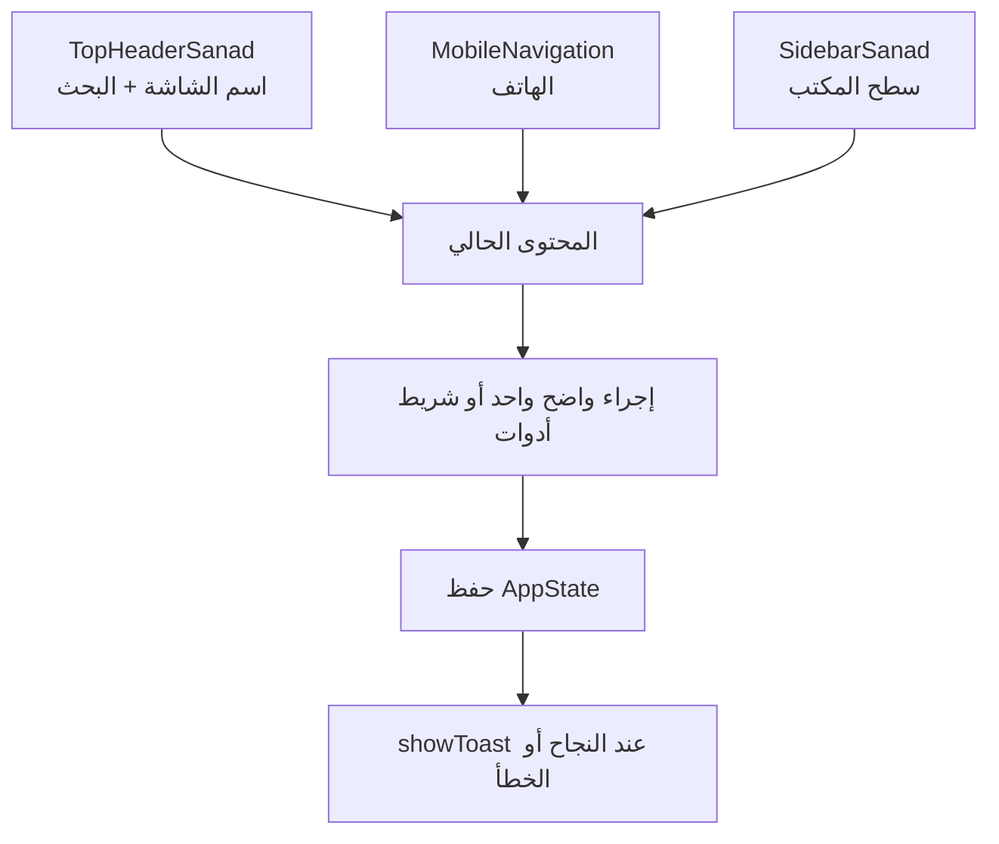
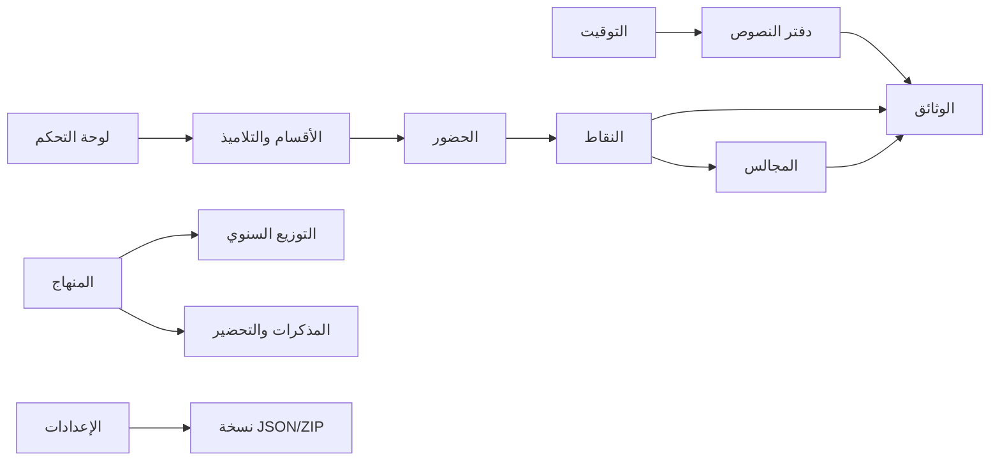
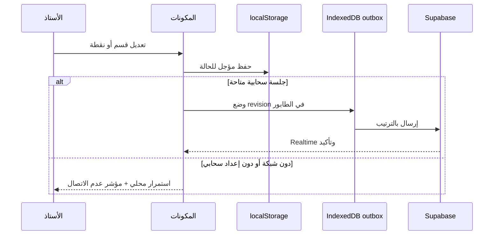

# دليل التصميم وتجربة الاستخدام

هذا الدليل يصف اللغة البصرية وسلوك الواجهة الفعليين في «معين الأستاذ». الهدف
هو مساعدة أستاذ العلوم الإسلامية على إنجاز العمل المتكرر بسرعة، مع إبقاء
البيانات مفهومة وقابلة للطباعة على الهاتف والحاسوب.

## 1. مبادئ UX

### سياق واحد، لا تنقل زائد

الشاشة تعمل حول قسم نشط وفصل نشط. ينتقل الأستاذ بين المهام من شريط واحد، مع
حفظ `tab` و`class` في عنوان URL ليكون الرابط قابلاً للفتح أو الإشارة المرجعية.

### Mobile-first Native

- الهاتف: شريط سفلي للوصول السريع وقائمة جانبية عند الحاجة.
- سطح المكتب: شريط جانبي قابل للطي ومساحة عمل أوسع للجداول.
- لا نضع عنوان صفحة ثانياً داخل المحتوى؛ العنوان الرسمي في `TopHeaderSanad`.
- الأهداف اللمسية كبيرة، والنصوص قصيرة، والجداول قابلة للتمرير الأفقي عند
  ضيق الشاشة.

### حالات واضحة وآمنة

كل عملية طويلة تعرض حالة تحميل. الحذف أو التعديل الحساس يمر عبر
`ConfirmDialog`. النتيجة أو فشل الحفظ يظهر عبر `showToast`؛ يمنع استخدام
`alert()` و`prompt()` و`confirm()`.

## 2. الهيكل البصري

الثيم فاتح فقط ويستخدم Slate + Ocean:

| المتغير | الاستخدام |
| --- | --- |
| `--primary` | الإجراء الأساسي، الحالة النشطة، والتقدم |
| `--primary-hover` | تمرير الزر الأساسي |
| `--primary-soft` | خلفية العناصر النشطة والرموز |
| `--accent-navy` | الشريط الجانبي والهوية |
| `--accent-gold` | العلامات المهنية والتنبيهات المهمة |
| `--success` | نجاح الحفظ أو الاستيراد |
| `--warning` | نقص البيانات أو وضع عدم الاتصال |
| `--danger` | الحذف والخطأ |
| `--text-primary` | النص الأساسي |
| `--text-secondary` | الوصف والمعلومات الثانوية |

تُعرّف القيم في [`app/globals.css`](./app/globals.css). لا تضف Hex داخل
المكونات، ولا تضف أصناف `dark:`؛ التطبيق مصمم للإضاءة فقط.

### المكونات

- **البطاقات:** سطح أبيض، `rounded-xl`، حدود هادئة، وظل خفيف.
- **الأزرار الأساسية:** متغير `--primary`، نص أبيض، وزن واضح، وحالة تمرير.
- **الأزرار الثانوية:** أبيض وحد هادئ دون منافسة الإجراء الأساسي.
- **الحقول:** تسمية ظاهرة، قيمة قابلة للقراءة، وخطأ قريب من الحقل.
- **الأيقونات:** `lucide-react` مع نص أو `aria-label`، لا تعتمد الأيقونة وحدها
  في الإجراءات المهمة.

## 3. خريطة التبويبات

ترتيب الاستخدام المقصود: يجهز الأستاذ الأقسام والتوقيت، يسجل الحصص والحضور،
يدخل التقييم، يراجع المؤشرات، ثم يطبع الوثائق. يمكن فتح أي تبويب مباشرة من
التنقل أو البحث الشامل.

## 4. التخزين والعمل دون اتصال

بيانات الحالة النصية في `localStorage`، أما PDF وطابور المزامنة ففي IndexedDB.
عند عودة الشبكة يعاد إرسال العناصر غير المرسلة. النسخ الاحتياطية تبقى المسار
الصريح لنقل البيانات بين الأجهزة أو المتصفحات.

## 5. الوصول والطباعة

- اتجاه المستند `rtl` ولغة الصفحة `ar`.
- الخط `Tajawal` للواجهة و`Amiri` للنصوص العربية الخاصة.
- رابط «الانتقال إلى المحتوى الرئيسي» متاح للوحة المفاتيح.
- البحث العالمي يدعم `Ctrl+K` و`Cmd+K`.
- عناصر التنقل تحمل `print:hidden`، وتوجد قواعد A4 للجداول والتقارير.
- كل حوار قابل للإغلاق من زر واضح، ولا يعتمد على نافذة المتصفح.

## 6. قواعد التطوير

1. مرر الحالة عبر `state` و`onUpdateState`، ولا تنشئ مصدراً ثانياً للحقيقة.
2. استخدم `getWeeklyHours()` عند عرض أو حساب ساعات المنهاج.
3. لا تغيّر محللات الرقمنة أو الممتاز دون اختبار ملفات حقيقية ونسخة احتياطية.
4. استخدم `exportToDoc` أو المصدر القائم لتصدير Word بدل تكرار منطق HTML.
5. أضف المكون إلى التبويب والحالة والتحميل والإشعارات معاً عند إنشاء وظيفة.
6. تحقق من RTL، والهاتف، والطباعة، ووضع عدم الاتصال قبل اعتماد تغيير بصري.
