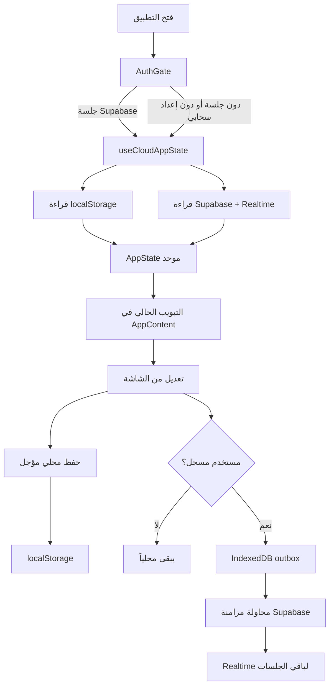
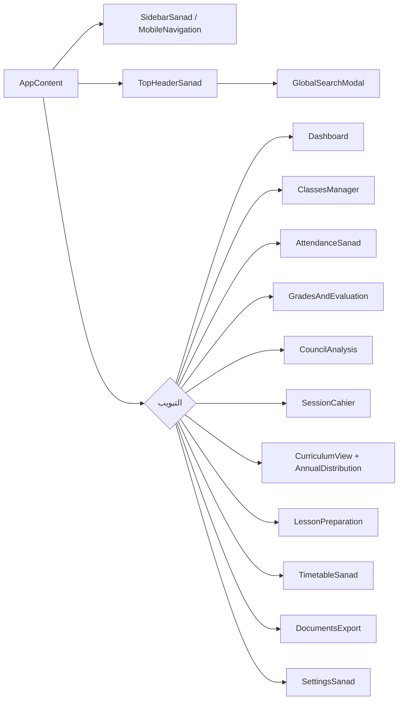

# معين الأستاذ — Mueen Al-Ostad

تطبيق عربي RTL يساعد أستاذ العلوم الإسلامية في التعليم الثانوي بالجزائر على
تحويل العمل اليومي من سجلات متفرقة إلى مساحة عمل واحدة: الأقسام والتلاميذ،
الحضور، النقاط، التخطيط، دفتر النصوص، والتحليل والتصدير.

> هذه الوثيقة تصف حالة المستودع الحالية كما هي في `main`. التطبيق ليس خدمة
> تعليمية عامة ولا يستعمل واجهة ذكاء اصطناعي خارجية في مسار التشغيل الحالي.

## ما الذي يقدمه التطبيق؟

| المجال | ما ينجزه الأستاذ |
| --- | --- |
| لوحة التحكم | ملخص الأقسام والتلاميذ والتقدم والحصة الحالية أو القادمة |
| الأقسام | إنشاء الأقسام، إدارة القوائم، واستيراد ملفات الرقمنة والممتاز |
| الحضور | تسجيل حاضر، غائب، متأخر، أو معذور وربط ذلك بالتقويم |
| النقاط | التقويم المستمر، الفرض، الاختبار، والمعدل الفصلي |
| المجالس | إحصاءات المعدلات، النجاح، التعثر، والغيابات حسب القسم والفصل |
| التوقيت | جدول الأحد إلى الخميس صباحاً ومساءً |
| دفتر النصوص | تاريخ الحصة، المنجز، الخطوات القادمة، وذاكرة الأستاذ |
| المنهاج والتوزيع | الوحدات الرسمية، الساعات الأسبوعية، والتقدم السنوي |
| المذكرات | بطاقة التحضير، المرفقات PDF، وقاعدة السندات |
| الوثائق | كشوف وقوائم وتقارير جاهزة للطباعة أو Word |
| الإعدادات | الملف المهني، السنة، الفصول، العطل، النسخ الاحتياطية والمزامنة |

## الحالة التقنية الحالية

- **Next.js 16.3.5** مع App Router وReact 19 وTypeScript.
- **Tailwind CSS 4.1** و`lucide-react`، مع واجهة فاتحة RTL وMobile-first.
- الصفحة الرئيسية في [`app/page.tsx`](./app/page.tsx) حاوية واحدة؛ التبويب
  يحفظ في عنوان URL عبر `?tab=` وسياق القسم عبر `?class=`.
- المصادقة والمزامنة السحابية اختيارية عبر Supabase. عند عدم توفرها يبقى
  التطبيق في وضع محلي.
- لا توجد API خاصة بالتطبيق: القراءة والكتابة تتم من مكونات العميل ومن
  Supabase Browser Client عند تسجيل الدخول.
- ملفات Excel تُحلل محلياً بواسطة `xlsx`، وملفات Word تُنتج كـ`.doc`.
- Service worker وmanifest يوفران تجربة PWA، مع استمرار العمل عند انقطاع
  الشبكة.

## تدفق التشغيل والبيانات



### طبقات التخزين

1. **`AppState`**: نموذج الحالة الموحد في
   [`lib/storage.ts`](./lib/storage.ts)، ويشمل الملف المهني والأقسام والتلاميذ
   والتوقيت والحصص والحضور والنقاط والمنهاج والإعدادات.
2. **`localStorage`**: نسخة العمل النصية تحت المفتاح
   `sanad_al_oustadh_state_v2`. الحفظ مؤجل لتقليل الكتابات، مع تحقق من
   النسخ المستوردة.
3. **IndexedDB**: ملفات PDF الثنائية وطابور التغييرات المؤجلة في
   [`lib/binary-storage.ts`](./lib/binary-storage.ts) و
   [`lib/sync-outbox.ts`](./lib/sync-outbox.ts).
4. **Supabase**: عند وجود جلسة وإعدادات صحيحة، تحفظ الحالة الأساسية في الجداول
   وتستقبل تحديثات Realtime. فشل السحابة لا يحذف النسخة المحلية.
5. **النسخ الاحتياطية**: JSON للبيانات المنظمة، وZIP للبيانات مع ملفات PDF عند
   استعمال أدوات الإعدادات.

## المسارات الرئيسية



كل شاشة تستقبل `state` وتحدّثه بواسطة `onUpdateState`. لذلك لا توجد حالة
موازية للأقسام أو النقاط داخل صفحات منفصلة يمكن أن تنحرف عن المصدر الموحد.

## قواعد المجال المهمة

### المنهاج والساعات

يعرّف [`lib/curriculum-data.ts`](./lib/curriculum-data.ts) المستويات الرسمية:
`1AS_ARTS` و`1AS_SCIENCE` و`2AS` و`3AS`. الدالة `getWeeklyHours()` تعيد ساعة
واحدة لـ`1AS_SCIENCE` وساعتين لباقي المستويات المدعومة.

### النقاط

تحسب [`lib/grade-calculator.ts`](./lib/grade-calculator.ts) التقويم المستمر
من السلوك والمواظبة والكراس والمشاركة، ثم تطبق:

```text
المعدل الفصلي = (التقويم المستمر + الفرض + (الاختبار × 2)) ÷ 4
```

العلامات محصورة بين 0 و20، ولا يعرض المعدل النهائي قبل اكتمال المدخلات
المطلوبة.

### الملفات

- محلل الرقمنة في [`lib/excel-sync.ts`](./lib/excel-sync.ts).
- محلل الممتاز في [`lib/moumtaze-sync.ts`](./lib/moumtaze-sync.ts).
- تطبيع الأسماء في [`lib/name-normalizer.ts`](./lib/name-normalizer.ts).
- تصدير Word وتنظيف HTML في [`lib/doc-exporter.ts`](./lib/doc-exporter.ts)
  و[`lib/utils.ts`](./lib/utils.ts).
- المذكرات الرسمية المحلية موجودة في
  [`public/memoranda/`](./public/memoranda/) وتربطها
  [`lib/local-memoranda-map.ts`](./lib/local-memoranda-map.ts).

## UX والتصميم

التطبيق مصمم كأداة Native mobile-first:

- عنوان الشاشة يظهر مرة واحدة في `TopHeaderSanad`، لا داخل بطاقة عنوان مكررة.
- الهاتف يستخدم `MobileNavigation`، وسطح المكتب يستخدم `SidebarSanad` القابل
  للطي.
- البحث الشامل يعمل من `Ctrl+K` أو `Cmd+K`.
- عمليات الحذف تمر عبر `ConfirmDialog`، والنتائج عبر `showToast`.
- توجد حالات تحميل، ووضع عدم الاتصال، وهدف انتقال لتجاوز التنقل إلى المحتوى.
- المظهر فاتح فقط؛ الألوان المعروضة تأتي من متغيرات
  [`app/globals.css`](./app/globals.css).
- قواعد الطباعة تخفي التنقل وتحسن مخرجات A4.

للتفاصيل البصرية والتفاعلية راجع [`DESIGN.md`](./DESIGN.md).

## بنية المشروع

```text
app/
  page.tsx             الحاوية والتنقل والتسجيل
  layout.tsx           RTL والخطوط وToastContainer
  globals.css          Tailwind والمتغيرات والطباعة
  auth/                مسار callback لـ PKCE
  manifest.ts          تعريف PWA
components/            شاشات التطبيق والمكونات المشتركة
hooks/
  useCloudAppState.ts  الحالة المحلية، Supabase، والطابور
lib/
  storage.ts           AppState والتحقق والنسخ
  supabase/            عميل Supabase ومزامنة الحالة
  curriculum-data.ts   المنهاج والساعات
  grade-calculator.ts  الحسابات والإحصاءات
  excel-sync.ts        استيراد الرقمنة
  moumtaze-sync.ts     استيراد الممتاز
  binary-storage.ts    ملفات IndexedDB
  backup-archive.ts    أرشيف النسخ واستعادتها
  doc-exporter.ts      تصدير المذكرات إلى Word
public/memoranda/      ملفات PDF الرسمية المدمجة
supabase/migrations/   مخطط السحابة وسياسات التكامل
__tests__/              اختبارات الحساب والتخزين والتاريخ
```

## التشغيل والتحقق

يتطلب المشروع Node.js متوافقاً مع Next.js 16:

```bash
npm install
npm run dev
```

ثم افتح `http://localhost:3000`. للإنتاج:

```bash
npm run lint
npm run test
npm run build
npm run start
```

لتمكين المزامنة، عرّف متغيرات Supabase في `.env.local` وفق
[`.env.example`](./.env.example)، وطبّق migrations الموجودة في
[`supabase/migrations/`](./supabase/migrations/). بدونها يعمل المسار المحلي
والنسخ الاحتياطي.

## حدود النطاق

المشروع مخصص لسير عمل أستاذ واحد، وليس نظام إدارة مدرسة متعدد الصلاحيات.
البيانات التعليمية حساسة: لا تضع ملفات `.env` أو نسخ JSON أو PDF الشخصية في
Git، ولا تعدّل محللات Excel أو بنية `AppState` دون تحديث اختبارات الاستيراد
والنسخ.
