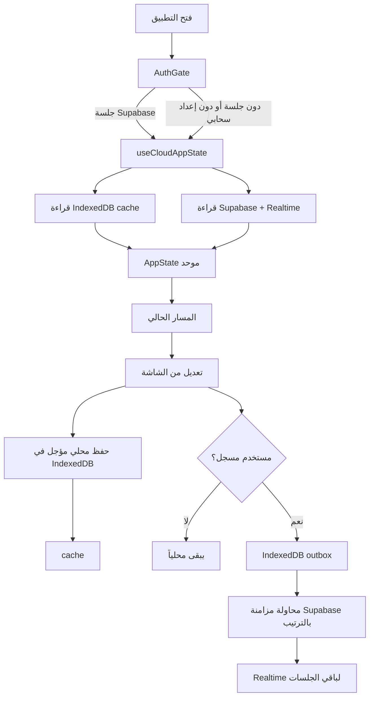

# معين الأستاذ — Mueen Al-Ostad

تطبيق عربي RTL يساعد أستاذ العلوم الإسلامية في التعليم الثانوي بالجزائر على
تحويل العمل اليومي من سجلات متفرقة إلى مساحة عمل واحدة: الأقسام والتلاميذ،
الحضور، النقاط، التخطيط، دفتر النصوص، والتحليل والتصدير.

**الرابط المباشر للإنتاج (Production Live):** [https://ostady.vercel.app](https://ostady.vercel.app)

> هذه الوثيقة تصف حالة المستودع الحالية كما هي في `main`. التطبيق أداة عمل شخصية للأستاذ
> (Personal Workflow PWA) وليس نظاماً مدرسياً متعدد الأدوار.

## الشعار وهوية التطبيق (Brand Identity & App Icon)

* **الرمز المعتمد:** ريشة قلم حبر كلاسيكية تنبثق من كتاب مفتوح مع رذاذ الألوان المائية الزرقاء البترولية ولمسات رقائق الذهب (`#E1EDF6` / `#2E7D9B` / `#1E4056` / `#CBA135`).
* **حزمة الأيقونات المعتمدة في `public/`:**
  * `pwa-192x192.png` و `pwa-512x512.png`: أيقونات الويب التقدمي (PWA).
  * `pwa-maskable-512x512.png`: مطابقة لمعيار Android Adaptive Icons (Safe Zone 80%).
  * `apple-touch-icon.png`: أيقونة أجهزة iOS / iPadOS (180×180).
  * `favicon.ico`: أيقونة شريط المتصفح متعددة الدقة (16، 32، 48).
  * `brand-logo-text.png`: الشعار الكامل مع كاليغرافي "مُعِين" لشاشات الترحيب والـ Hero.
* **قاعدة الأيقونة النظيفة:** خلفية الأيقونة ممتدة بنسبة 100% بلون الكانفاس الموحد `#E1EDF6`؛ تم تجريدها تماماً من أي ورق خارجي أو ظلال ثلاثية الأبعاد (Drop Shadows) أو حواف مقتطعة.

## ما الذي يقدمه التطبيق؟

| المجال | ما ينجزه الأستاذ |
| --- | --- |
| لوحة التحكم | ملخص الأقسام والتلاميذ والتقدم والحصة الحالية أو القادمة |
| الأقسام | إنشاء الأقسام، إدارة القوائم، واستيراد ملفات الرقمنة والممتاز |
| الحضور | تسجيل حاضر، غائب، متأخر، أو معذور وربط ذلك بالتقويم |
| النقاط | التقويم المستمر، الفرض، الاختبار، والمعدل الفصلي |
| المجالس | إحصاءات المعدلات، النجاح، التعثر، والغيابات حسب القسم والفصل |
| التوقيت | جدول الأحد إلى الخميس صباحاً ومساءً |
| دفتر النصوص | تاريخ الحصة، المنجز، الخطوات القادمة، وذاكرة الأستاذ |
| المنهاج والتوزيع | الوحدات الرسمية، الساعات الأسبوعية، والتقدم السنوي |
| المذكرات | بطاقة التحضير، المرفقات PDF، وقاعدة السندات |
| الوثائق | كشوف وقوائم وتقارير جاهزة للطباعة أو Word |
| الإعدادات | الملف المهني، السنة، الفصول، العطل، النسخ الاحتياطية والمزامنة |

## المعمارية الحالية (إعادة البناء الجذرية)

- جرد الحالة والأجزاء القابلة للتغيير محفوظ في
  [`STATE-INVENTORY.md`](./STATE-INVENTORY.md)، ويجب تحديثه قبل وبعد أي تغيير
  يمس بيانات المستخدم أو دورة المزامنة.
- **Next.js 16.3.5** مع App Router وReact 19 وTypeScript.
- **Tailwind CSS 4.1** و`lucide-react`، مع واجهة فاتحة RTL وMobile-first.
- كل وظيفة مساحة عمل لها مسار مستقل قابل للمشاركة: `/dashboard`، `/classes`،
  `/attendance`، `/grades`، `/council`، `/sessions`،
  `/annual-distribution`، `/curriculum`، `/timetable`،
  `/lesson-preparation`، `/documents`، و`/settings`. لا يوجد `?tab`؛ يحدد
  `usePathname` الشاشة ويستخدم `router.push` للتنقل. المسار الجذري يعيد
  التوجيه إلى `/dashboard`.
- `app/layout.tsx` وملفات المسارات الخفيفة Server Components افتراضياً، بينما
  حاوية التطبيق والمكونات التفاعلية Client Components (`'use client'`). لا
  تعبر hooks أو كائنات المتصفح حدود RSC؛ تمرر الحالة والأفعال عبر Props.
- المصادقة والمزامنة السحابية عبر Supabase (Postgres + RLS + Realtime). عند عدم توفرها يبقى
  التطبيق في وضع محلي كامل (Offline First).
- المزامنة تستخدم طابور تحولات تفاضلي (Delta Mutations Outbox) مع ساعة المراجعات `cloudRevision`،
  وإلغاء الصدى المتكرر عبر `sync_device_id`، وروابط مذكرات موقعة تدوم 7 أيام.
- ملفات Excel تُحلل محلياً بواسطة `xlsx`، وملفات Word تُنتج كـ`.doc`.
- Service worker (`/sw.js`) وmanifest يوفران تجربة PWA كاملة مع استمرار العمل دون إنترنت.

## تدفق التشغيل والبيانات



### طبقات التخزين

1. **`AppState`**: نموذج الحالة الموحد في
   [`lib/storage.ts`](./lib/storage.ts)، ويشمل الملف المهني والأقسام والتلاميذ
   والتوقيت والحصص والحضور والنقاط والمنهاج والإعدادات.
2. **IndexedDB cache**: نسخة العمل المحلية المعيارية للنسخة الجديدة فقط،
   والتحقق من البيانات المستوردة. لا تُرحّل لقطات `localStorage` القديمة.
   الحفظ مؤجل لتقليل الكتابات.
3. **IndexedDB binary/outbox**: ملفات PDF الثنائية وطابور revisions المؤجلة في
   [`lib/binary-storage.ts`](./lib/binary-storage.ts) و
   [`lib/sync-outbox.ts`](./lib/sync-outbox.ts). لا تُفقد التغييرات عند انقطاع
   الشبكة، وتُرسل بالترتيب عند عودتها.
4. **Supabase العلائقي**: عند وجود جلسة وإعدادات صحيحة تحفظ البيانات في
   جداول `profiles`, `app_settings`, `classes`, `students`, `grades`,
   `sessions`, `attendance`, `session_behaviors`, `timetable_slots`,
   `lesson_progress`, `lesson_plans`, `custom_units` وملفات المذكرات، مع
   مفاتيح خارجية وRLS وRealtime. `app_settings` يحمل الإعدادات وrevision،
   ويدعم النظام tombstones وسجل `sync_conflicts` مع رفض صريح للتحديث القديم.
   فشل السحابة لا يحذف النسخة المحلية.
   كل هذه الجداول مضافة إلى `supabase_realtime`، ويجب قبل إضافة أي جزء جديد
   تحديد مصدره في Supabase ومسار outbox وإعادة المحاولة والفشل والحذف.
5. **النسخ الاحتياطية**: JSON للبيانات المنظمة، وZIP للبيانات مع ملفات PDF عند
   استعمال أدوات الإعدادات.

### حالات المزامنة

`loading` تعني انتظار قراءة الحالة السحابية، و`ready` تعني اتصالاً سحابياً
فعّالاً، و`sync-pending` تعني وجود تغييرات محلية بانتظار الإرسال، و
`sync-failed` أو `conflict` تعني أن المزامنة تحتاج إعادة المحاولة، بينما
`local-only` تعني أن التطبيق يعمل محلياً بسبب غياب الإعداد أو تعذر المخطط/الشبكة. التغييرات المحلية تدخل outbox وتُعاد محاولتها؛ لا تعتبر الشاشة
التغيير سحابياً قبل تأكيد الإرسال.

### المخطط العلائقي والهوية

كل صف سحابي مملوك لـ`auth.uid()` وتفرض RLS عزل المستخدمين. ترتبط الدرجات
بالتلميذ والقسم، وترتبط الحصص والحضور والسلوك بالقسم/التلميذ، بينما تحفظ
`app_settings` البيانات التكميلية التي لا تستحق جدولاً مستقلاً. لا تعدّل
المخطط يدوياً ولا تضف جداول بديلة خارج migrations.

### البيانات التجريبية وإعادة الضبط

البيانات الابتدائية في `lib/storage.ts` بيانات عرض فقط وليست workspace قابلة
للترحيل. إذا كانت السحابة فارغة يُعاد المستخدم إلى حالة فارغة، ولا تُرفع
بيانات العرض إلى Supabase. وظيفة `reset_workspace` تجريبية ومدمّرة: تحذف
بيانات المستخدم وملفات المذكرات والتعارضات من السحابة، ولا يمكن التراجع عنها؛
تستلزم تأكيداً صريحاً ونسخة احتياطية قبل التنفيذ.

## قواعد المجال المهمة

### المنهاج والساعات

يعرّف [`lib/curriculum-data.ts`](./lib/curriculum-data.ts) المستويات الرسمية:
`1AS_ARTS` و`1AS_SCIENCE` و`2AS` و`3AS`. الدالة `getWeeklyHours()` تعيد ساعة
واحدة لـ`1AS_SCIENCE` وساعتين لباقي المستويات المدعومة.

### النقاط

تحسب [`lib/grade-calculator.ts`](./lib/grade-calculator.ts) التقويم المستمر
من السلوك والمواظبة والكراس والمشاركة، ثم تطبق:

```text
المعدل الفصلي = (التقويم المستمر + الفرض + (الاختبار × 2)) ÷ 4
```

العلامات محصورة بين 0 و20، ولا يعرض المعدل النهائي قبل اكتمال المدخلات
المطلوبة.

### الملفات

- محلل الرقمنة في [`lib/excel-sync.ts`](./lib/excel-sync.ts).
- محلل الممتاز في [`lib/moumtaze-sync.ts`](./lib/moumtaze-sync.ts).
- تطبيع الأسماء في [`lib/name-normalizer.ts`](./lib/name-normalizer.ts).
- تصدير Word وتنظيف HTML في [`lib/doc-exporter.ts`](./lib/doc-exporter.ts)
  و[`lib/utils.ts`](./lib/utils.ts).
- المذكرات الرسمية المحلية موجودة في
  [`public/memoranda/`](./public/memoranda/) وتربطها
  [`lib/local-memoranda-map.ts`](./lib/local-memoranda-map.ts).

## UX والتصميم

التطبيق مصمم كأداة Native mobile-first:

- عنوان الشاشة يظهر مرة واحدة في `TopHeaderSanad`، لا داخل بطاقة عنوان مكررة.
- الهاتف يستخدم `MobileNavigation`، وسطح المكتب يستخدم `SidebarSanad` القابل
  للطي.
- البحث الشامل يعمل من `Ctrl+K` أو `Cmd+K`.
- عمليات الحذف تمر عبر `ConfirmDialog`، والنتائج عبر `showToast`.
- توجد حالات تحميل، ووضع عدم الاتصال، وهدف انتقال لتجاوز التنقل إلى المحتوى.
- المظهر فاتح فقط؛ الألوان المعروضة تأتي من متغيرات
  [`app/globals.css`](./app/globals.css).
- قواعد الطباعة تخفي التنقل وتحسن مخرجات A4.
- استخدم أشرطة أدوات مدمجة بدلاً من عناوين محتوى مكررة، واحترم أهداف اللمس
  وRTL، ولا تستخدم `dark:` أو ألوان Hex داخل المكونات.
- لا تستخدم `alert()` أو `prompt()` أو `confirm()`؛ استخدم `showToast()` و
  `<ConfirmDialog>`.

للتفاصيل البصرية والتفاعلية راجع [`DESIGN.md`](./DESIGN.md).

## بنية المشروع

```text
app/
  page.tsx             حاوية العميل وحدود التفاعل والتنقل بالمسارات
  layout.tsx           RTL والخطوط وToastContainer
  globals.css          Tailwind والمتغيرات والطباعة
  [...slug]/page.tsx   جسر المسارات المستقلة إلى حاوية التطبيق
  auth/                مسار callback لـ PKCE
  manifest.ts          تعريف PWA
components/            شاشات التطبيق والمكونات المشتركة
hooks/
  useCloudAppState.ts  الحالة المحلية، Supabase، والطابور
lib/
  storage.ts           AppState والتحقق وIndexedDB cache
  supabase/            عميل Supabase ومزامنة الحالة
  curriculum-data.ts   المنهاج والساعات
  grade-calculator.ts  الحسابات والإحصاءات
  excel-sync.ts        استيراد الرقمنة
  moumtaze-sync.ts     استيراد الممتاز
  binary-storage.ts    ملفات PDF في IndexedDB
  sync-outbox.ts       طابور revisions في IndexedDB
  backup-archive.ts    أرشيف النسخ واستعادتها
  doc-exporter.ts      تصدير المذكرات إلى Word
public/memoranda/      ملفات PDF الرسمية المدمجة
supabase/migrations/   مخطط السحابة وسياسات التكامل
__tests__/              اختبارات الحساب والتخزين والتاريخ
```

## التشغيل والتحقق

يتطلب المشروع Node.js متوافقاً مع Next.js 16:

```bash
npm install
npm run dev
```

ثم افتح `http://localhost:3000`. للإنتاج والتحقق الشامل:

```bash
npm run lint    # فحص خلو الأكواد من الأخطاء والتحذيرات (0 errors, 0 warnings)
npm run test    # تشغيل 36 اختباراً مؤتمتاً في Vitest عبر 4 حزم اختبار
npm run build   # بناء حزمة الإنتاج بواسطة Webpack
npm run start   # تشغيل خادم الإنتاج
```

لتمكين المزامنة، عرّف متغيرات Supabase في `.env.local` وفق
[`.env.example`](./.env.example)، وطبّق migrations الموجودة في
[`supabase/migrations/`](./supabase/migrations/). بدونها يعمل المسار المحلي
والنسخ الاحتياطي.

## حدود النطاق

المشروع مخصص لسير عمل أستاذ واحد، وليس نظام إدارة مدرسة متعدد الصلاحيات.
البيانات التعليمية حساسة: لا تضع ملفات `.env` أو نسخ JSON أو PDF الشخصية في
Git، ولا تعدّل محللات Excel أو بنية `AppState` دون تحديث اختبارات الاستيراد
والنسخ.
